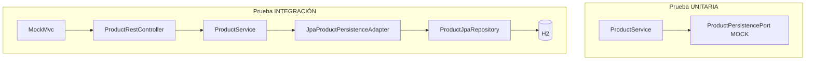

# Guía completa de pruebas — ms-common-product

Documento de estudio (arquitectura hexagonal + Spring Boot + JUnit 5 + Mockito + MockMvc).  
Puedes guardar, imprimir o mover este archivo `.md` donde quieras; **no forma parte del código** del microservicio.

---

## Tabla de contenidos

1. [Objetivo de las pruebas en este proyecto](#1-objetivo-de-las-pruebas-en-este-proyecto)
2. [Las 13 pruebas (catálogo completo)](#2-las-13-pruebas-catálogo-completo)
3. [Tipos de prueba y qué cubren](#3-tipos-de-prueba-y-qué-cubren)
4. [Patrones que usamos](#4-patrones-que-usamos)
5. [Estructura de carpetas y archivos](#5-estructura-de-carpetas-y-archivos)
6. [Configuración a nivel de proyecto (Maven + H2)](#6-configuración-a-nivel-de-proyecto-maven--h2)
7. [Organización dentro de cada clase de test](#7-organización-dentro-de-cada-clase-de-test)
8. [Anotaciones — referencia completa](#8-anotaciones--referencia-completa)
9. [Imports estáticos y APIs que usamos](#9-imports-estáticos-y-apis-que-usamos)
10. [Mockito en detalle (pruebas unitarias)](#10-mockito-en-detalle-pruebas-unitarias)
11. [MockMvc en detalle (pruebas de integración)](#11-mockmvc-en-detalle-pruebas-de-integración)
12. [Relación con la arquitectura hexagonal](#12-relación-con-la-arquitectura-hexagonal)
13. [Cómo ejecutar y ver cada prueba](#13-cómo-ejecutar-y-ver-cada-prueba)
14. [Glosario rápido](#14-glosario-rápido)

---

## 1. Objetivo de las pruebas en este proyecto

El microservicio `ms-common-product` implementa un **CRUD de productos** con arquitectura hexagonal:

- **domain** — modelo `Product`
- **application** — `ProductService` + puertos (`ProductUseCase`, `ProductPersistencePort`)
- **infrastructure** — adaptador web (REST) y adaptador de persistencia (JPA)

Las pruebas validan dos cosas distintas:

| Pregunta | Tipo de prueba |
|----------|----------------|
| ¿La lógica del caso de uso es correcta? | **Unitaria** (`ProductServiceTest`) |
| ¿El API HTTP y la BD de prueba funcionan juntos? | **Integración** (`ProductRestControllerIntegrationTest`) |
| ¿Spring arranca sin errores de configuración? | **Smoke** (`MsCommonProductApplicationTests`) |

---

## 2. Las 13 pruebas (catálogo completo)

| # | Tipo | Clase | Método | Qué valida |
|---|------|-------|--------|------------|
| 1 | Smoke | `MsCommonProductApplicationTests` | `contextLoads` | El contexto Spring Boot inicia en modo test |
| 2 | Unitaria | `ProductServiceTest` | `givenValidProduct_whenCreateProduct_thenReturnsCreatedProduct` | CREATE ok + llamada a `save` |
| 3 | Unitaria | `ProductServiceTest` | `givenInvalidPrice_whenCreateProduct_thenReturnsValidationError` | CREATE con precio 0 → error, sin `save` |
| 4 | Unitaria | `ProductServiceTest` | `givenExistingId_whenGetProductById_thenReturnsProduct` | READ por id existente |
| 5 | Unitaria | `ProductServiceTest` | `givenMissingId_whenGetProductById_thenReturnsNotFoundError` | READ id inexistente → `PRODUCT_NOT_FOUND` |
| 6 | Unitaria | `ProductServiceTest` | `givenProductsInPort_whenFindAllProducts_thenReturnsList` | READ listar todos |
| 7 | Unitaria | `ProductServiceTest` | `givenExistingProduct_whenUpdateProduct_thenReturnsUpdatedProduct` | UPDATE ok |
|  8 | Unitaria | `ProductServiceTest` | `givenExistingProduct_whenDeleteProduct_thenDeletesSuccessfully` | DELETE ok + `deleteById` |
| 9 | Integración | `ProductRestControllerIntegrationTest` | `givenValidRequest_whenCreateProduct_thenReturnsCreatedProduct` | POST → 201 + 1 fila en H2 |
| 10 | Integración | `ProductRestControllerIntegrationTest` | `givenExistingProduct_whenFindProductById_thenReturnsProduct` | GET por id → 200 |
| 11 | Integración | `ProductRestControllerIntegrationTest` | `givenExistingProduct_whenFindAllProducts_thenReturnsList` | GET listado → 200 |
| 12 | Integración | `ProductRestControllerIntegrationTest` | `givenExistingProduct_whenUpdateProduct_thenReturnsUpdatedProduct` | PUT → 200 + cambio en H2 |
| 13 | Integración | `ProductRestControllerIntegrationTest` | `givenExistingProduct_whenDeleteProduct_thenRemovesItFromDatabase` | DELETE → 204 + fila borrada |

**Total:** 1 smoke + 7 unitarias + 5 integración = **13**.

---

## 3. Tipos de prueba y qué cubren

### 3.1 Prueba unitaria

- **Archivo:** `ProductServiceTest.java`
- **Sujeto bajo prueba:** solo `ProductService` (capa application).
- **Colaborador simulado:** `ProductPersistencePort` con **Mockito** (`@Mock`).
- **No se usa:** Spring Boot completo, HTTP, H2, PostgreSQL, JPA real.

```
ProductService  ──usa──▶  ProductPersistencePort (FAKE / mock)
```

### 3.2 Prueba de integración

- **Archivo:** `ProductRestControllerIntegrationTest.java`
- **Sujeto bajo prueba:** flujo desde HTTP hasta H2.
- **Todo real en el flujo:** `ProductRestController`, `ProductService`, `JpaProductPersistenceAdapter`, `ProductJpaRepository`, mappers MapStruct.
- **Base de datos:** H2 en memoria (`src/test/resources/application.yaml`).

```
MockMvc (HTTP simulado)
  → ProductRestController
  → ProductRestMapper
  → ProductService
  → JpaProductPersistenceAdapter
  → ProductJpaRepository
  → H2
```

### 3.3 Smoke test

- **Archivo:** `MsCommonProductApplicationTests.java`
- **Qué hace:** levanta el `ApplicationContext` de Spring. Si no explota, los beans están cableados.
- **No valida:** reglas de negocio ni respuestas HTTP.

---

## 4. Patrones que usamos

### 4.1 BDD — Given / When / Then

Cada test se lee en tres fases (en comentarios numerados `1`, `2`, `3`…):

| Fase | Significado | Ejemplo unitario |
|------|-------------|------------------|
| **Given** | Preparar el escenario | Mock: `findById(1L)` devuelve un producto |
| **When** | Ejecutar la acción | `productService.createProduct(...)` |
| **Then** | Comprobar el resultado | `assertTrue(applicationResult.isOk())` |

Los nombres de métodos siguen la convención:

`given{Condición}_when{Acción}_then{ResultadoEsperado}`

Ejemplo: `givenValidProduct_whenCreateProduct_thenReturnsCreatedProduct`.

### 4.2 AAA (Arrange – Act – Assert)

Es el mismo concepto que BDD con otros nombres:

- **Arrange** = Given  
- **Act** = When  
- **Assert** = Then  

### 4.3 Test Double — “doble de prueba”

En unitarias, `ProductPersistencePort` no es real: es un **mock** (doble que tú programas con `given(...)`).

| Término | En este proyecto |
|---------|------------------|
| **Mock** | `ProductPersistencePort` en `ProductServiceTest` |
| **Real** | Todo el stack en `ProductRestControllerIntegrationTest` |

### 4.4 Aislamiento hexagonal en tests

| Capa | Unitaria | Integración |
|------|----------|-------------|
| application (`ProductService`) | ✅ Probada sola | ✅ Real |
| Puerto `ProductPersistencePort` | ❌ Simulado | ✅ Implementado por adaptador JPA |
| Adaptador web | ❌ No participa | ✅ `ProductRestController` + MockMvc |
| BD | ❌ No existe | ✅ H2 |

### 4.5 Organización “datos arriba, pruebas abajo”

Al inicio de cada clase de test (después de `@Autowired` / `@Mock`):

- `validCreateRequest()` — arma el DTO de POST  
- `validUpdateRequest()` — arma el DTO de PUT  
- `persistProduct()` — inserta en H2  
- `validProductToCreate()` / `validProductWithId()` — dominio para unitarias  

Los `@Test` van **debajo**, para que al abrir el archivo se vea primero **qué datos** se usan.

### 4.6 Nombres largos de variables

Convención alineada con producción:

- `dCreateProductRequest` (no `request`)
- `dUpdateProductRequest` (no `updateRequest`)
- `applicationResult` (no `result`)
- `productEntityPersisted` (no `entity`)

---

## 5. Estructura de carpetas y archivos

```
ms-common-product/
├── pom.xml                          ← dependencias test (starter-test, h2)
└── src/
    ├── main/                        ← código de producción
    └── test/
        ├── java/com/practice/
        │   ├── MsCommonProductApplicationTests.java     (#1 smoke)
        │   ├── application/service/
        │   │   └── ProductServiceTest.java              (#2–#8 unitarias)
        │   └── infrastructure/web/controller/
        │       └── ProductRestControllerIntegrationTest.java  (#9–#13 integración)
        └── resources/
            └── application.yaml     ← H2 solo para tests
```

---

## 6. Configuración a nivel de proyecto (Maven + H2)

### 6.1 Dependencias en `pom.xml` (scope `test`)

| Dependencia | Para qué sirve |
|-------------|----------------|
| `spring-boot-starter-test` | JUnit 5, Mockito, AssertJ, Spring Test, MockMvc |
| `h2` | Base en memoria en integración (no toca PostgreSQL local) |

No hace falta declarar `junit-jupiter` ni `mockito-core` por separado: ya vienen en el starter.

### 6.2 `src/test/resources/application.yaml`

Solo aplica cuando corre un test con `@SpringBootTest`:

```yaml
spring:
  datasource:
    url: jdbc:h2:mem:ms_common_product_test;DB_CLOSE_DELAY=-1
  jpa:
    hibernate:
      ddl-auto: create-drop
```

| Propiedad | Significado |
|-----------|-------------|
| `jdbc:h2:mem:...` | BD en RAM, se destruye al terminar la JVM |
| `create-drop` | Crea tablas al inicio del test y las borra al cerrar el contexto |
| PostgreSQL de `main` | **No se usa** en tests si este YAML está en `src/test/resources` |

---

## 7. Organización dentro de cada clase de test

### 7.1 `ProductServiceTest` (unitarias)

```
@ExtendWith(MockitoExtension.class)   ← activa Mockito en JUnit 5
class ProductServiceTest {
    @Mock ProductPersistencePort ...
    @InjectMocks ProductService ...

    validProductToCreate()      ← arriba
    validProductWithId(id)      ← arriba

    @Test void givenValidProduct_...() { Given / When / Then }
    ...
}
```

### 7.2 `ProductRestControllerIntegrationTest` (integración)

```
@SpringBootTest
@AutoConfigureMockMvc
class ProductRestControllerIntegrationTest {
    @Autowired MockMvc, ObjectMapper, ProductJpaRepository

    validCreateRequest()    ← arriba
    validUpdateRequest()    ← arriba
    persistProduct()        ← arriba

    @BeforeEach cleanDatabase()

    @Test void givenValidRequest_...() { ... }
    ...
}
```

### 7.3 Javadoc

- **En la clase:** qué pruebas incluye (#2–#8, #9–#13).
- **En cada `@Test`:** número de prueba, operación CRUD y objetivo en una frase.
- **No** usamos bloques largos `// ====` fuera de la clase; la explicación va en Javadoc + comentarios Given/When/Then dentro del método.

---

## 8. Anotaciones — referencia completa

### 8.1 JUnit 5

#### `@Test`

| | |
|---|---|
| **Paquete** | `org.junit.jupiter.api.Test` |
| **Dónde** | En cada método de prueba |
| **Para qué** | Marca un método como prueba ejecutable por JUnit |
| **Sin esto** | Maven/IDE no lo ejecutan como test |

```java
@Test
void givenValidProduct_whenCreateProduct_thenReturnsCreatedProduct() { ... }
```

---

#### `@ExtendWith(MockitoExtension.class)`

| | |
|---|---|
| **Paquete** | `org.junit.jupiter.api.extension.ExtendWith` + `org.mockito.junit.jupiter.MockitoExtension` |
| **Dónde** | En la **clase** `ProductServiceTest` |
| **Para qué** | Conecta JUnit 5 con Mockito: inicializa `@Mock` y `@InjectMocks` antes de cada test |
| **Alternativa antigua** | `@RunWith(MockitoJUnitRunner.class)` en JUnit 4 |
| **No va en** | Tests de integración con `@SpringBootTest` (ahí Spring inyecta beans reales) |

---

#### `@BeforeEach`

| | |
|---|---|
| **Paquete** | `org.junit.jupiter.api.BeforeEach` |
| **Dónde** | Método `cleanDatabase()` en integración |
| **Para qué** | Se ejecuta **antes de cada** `@Test` de esa clase |
| **En este proyecto** | `productJpaRepository.deleteAll()` para que cada test empiece con H2 vacía |

---

### 8.2 Mockito

#### `@Mock`

| | |
|---|---|
| **Paquete** | `org.mockito.Mock` |
| **Dónde** | Campo `productPersistencePort` en `ProductServiceTest` |
| **Para qué** | Crea un objeto **falso** que implementa la interfaz del puerto |
| **Comportamiento** | Por defecto devuelve `null` / vacío; tú defines respuestas con `given(...)` |

---

#### `@InjectMocks`

| | |
|---|---|
| **Paquete** | `org.mockito.InjectMocks` |
| **Dónde** | Campo `productService` en `ProductServiceTest` |
| **Para qué** | Crea una instancia **real** de `ProductService` e inyecta los `@Mock` en su constructor |
| **Resultado** | Pruebas el servicio de verdad, pero el puerto es simulado |

```
@InjectMocks ProductService  ← objeto real
        ↑
   inyecta
        ↑
@Mock ProductPersistencePort  ← simulación
```

---

### 8.3 Spring Boot Test

#### `@SpringBootTest`

| | |
|---|---|
| **Paquete** | `org.springframework.boot.test.context.SpringBootTest` |
| **Dónde** | `MsCommonProductApplicationTests`, `ProductRestControllerIntegrationTest` |
| **Para qué** | Levanta el **contexto completo** de Spring Boot (como arrancar la app en modo test) |
| **Incluye** | Todos los `@Service`, `@Repository`, `@RestController`, configuración, etc. |
| **Coste** | Más lento que una unitaria pura |

---

#### `@AutoConfigureMockMvc`

| | |
|---|---|
| **Paquete** | `org.springframework.boot.test.autoconfigure.web.servlet.AutoConfigureMockMvc` |
| **Dónde** | Clase `ProductRestControllerIntegrationTest` (junto con `@SpringBootTest`) |
| **Para qué** | Registra un bean `MockMvc` para simular peticiones HTTP **sin** abrir el puerto 8081 |
| **Sin esto** | Tendrías que levantar el servidor real o configurar MockMvc a mano |

---

#### `@Autowired` (en clases de test)

| | |
|---|---|
| **Paquete** | `org.springframework.beans.factory.annotation.Autowired` |
| **Dónde** | `mockMvc`, `objectMapper`, `productJpaRepository` en integración |
| **Para qué** | Spring inyecta beans **reales** del contexto de test |
| **Diferencia con `@InjectMocks`** | `@Autowired` = Spring; `@InjectMocks` = Mockito en unitarias |

---

### 8.4 Resumen: qué anotación va en cada clase

| Clase | Anotaciones de clase / campos |
|-------|------------------------------|
| `MsCommonProductApplicationTests` | `@SpringBootTest` |
| `ProductServiceTest` | `@ExtendWith(MockitoExtension)`, `@Mock`, `@InjectMocks` |
| `ProductRestControllerIntegrationTest` | `@SpringBootTest`, `@AutoConfigureMockMvc`, `@Autowired`, `@BeforeEach` |

Todas usan `@Test` en cada método de prueba.

---

## 9. Imports estáticos y APIs que usamos

Los `import static ...` permiten escribir `assertTrue(...)` en lugar de `Assertions.assertTrue(...)`.

### 9.1 Assertions (JUnit)

| Import | Uso |
|--------|-----|
| `assertTrue` | `applicationResult.isOk()` / `isFail()` |
| `assertEquals` | Comparar id, códigos de error, tamaño de lista, datos en H2 |

### 9.2 Mockito BDD

| Import | Uso |
|--------|-----|
| `given(...).willReturn(...)` | **Given:** definir comportamiento del mock |
| `then(...).should()` | **Then:** verificar que se llamó un método del mock |
| `then(...).should(never())` | Verificar que **no** se llamó (ej. `save` tras validación fallida) |
| `any(Product.class)` | “Cualquier instancia de Product” al verificar `save` |

### 9.3 MockMvc

| Import | Uso |
|--------|-----|
| `post`, `get`, `put`, `delete` | Construir petición HTTP |
| `status()` | Matcher del código HTTP (200, 201, 204…) |
| `jsonPath` | Assert sobre JSON (`$.name`, `$[0].name`) |

### 9.4 Spring

| Import | Uso |
|--------|-----|
| `MediaType.APPLICATION_JSON` | Header `Content-Type` en POST/PUT |

---

## 10. Mockito en detalle (pruebas unitarias)

### 10.1 Configurar el mock (Given)

```java
given(productPersistencePort.save(productToCreate)).willReturn(productCreated);
```

Significa: *cuando* el servicio llame a `save(productToCreate)`, el mock *devolverá* `productCreated`.

```java
given(productPersistencePort.findById(99L)).willReturn(Optional.empty());
```

Simula “no existe producto con id 99”.

### 10.2 Verificar interacciones (Then)

```java
then(productPersistencePort).should().save(productToCreate);
```

El servicio **sí** delegó el guardado en el puerto.

```java
then(productPersistencePort).should(never()).save(any(Product.class));
```

Si la validación falla, **nunca** debe intentar persistir.

### 10.3 `ApplicationResult` en assertions

El servicio no lanza excepción para errores de negocio: devuelve `ApplicationResult.fail(...)`. Por eso se usa:

- `applicationResult.isOk()`
- `applicationResult.isFail()`
- `applicationResult.getError().getCode()`

---

## 11. MockMvc en detalle (pruebas de integración)

### 11.1 Flujo de un test POST

```java
mockMvc.perform(post("/api/product/create-product")
        .contentType(MediaType.APPLICATION_JSON)
        .content(objectMapper.writeValueAsString(dCreateProductRequest)))
    .andExpect(status().isCreated())
    .andExpect(jsonPath("$.name").value("Teclado mecánico"));
```

| Paso | Qué hace |
|------|----------|
| `perform(post(...))` | Dispara la petición contra el adaptador web |
| `contentType` + `content` | Body JSON como un cliente real |
| `andExpect(status()...)` | Comprueba código HTTP |
| `jsonPath("$.name")` | Comprueba campo del JSON de respuesta |

### 11.2 Verificar H2 después del HTTP

```java
assertEquals(1, productJpaRepository.count());
```

Confirma que la integración **no solo respondió bien**, sino que **persistió** en la BD de test.

### 11.3 `persistProduct()` vs POST

| Método | Cuándo |
|--------|--------|
| `validCreateRequest()` + POST | Test #9 — prueba **crear por API** |
| `persistProduct()` | Tests #10–#13 — **preparar** datos en H2 sin pasar por HTTP |

Así GET/PUT/DELETE no dependen de que el test de CREATE haya corrido antes.

### 11.4 Códigos HTTP esperados en este CRUD

| Operación | Endpoint | Status |
|-----------|----------|--------|
| Create | POST `/api/product/create-product` | **201** Created |
| Read | GET `.../find-product-by-id/{id}` | **200** OK |
| List | GET `.../find-all-products` | **200** OK |
| Update | PUT `.../update-product/{id}` | **200** OK |
| Delete | DELETE `.../delete-product/{id}` | **204** No Content |

---

## 12. Relación con la arquitectura hexagonal



| Concepto hexagonal | En unitaria | En integración |
|--------------------|-------------|----------------|
| Puerto de entrada `ProductUseCase` | Probado vía `ProductService` | Real |
| Puerto de salida `ProductPersistencePort` | Mock | Real (adaptador JPA) |
| Adaptador web | No | `ProductRestController` + MockMvc |
| Dominio `Product` | Objetos reales en memoria | Traducido desde/hacia DTOs |

**Regla que aplicamos:**

- **Unitaria** = un solo “hexágono interior” (application) con puerto simulado.  
- **Integración** = atravesar adaptadores reales hasta la frontera técnica (HTTP + BD H2).

---

## 13. Cómo ejecutar y ver cada prueba

### 13.1 IntelliJ / Cursor (recomendado)

1. Abrir la clase de test.  
2. Clic en el icono verde junto a la clase o a un `@Test`.  
3. En la ventana **Run** se lista **cada método** con ✓ o ✗.

Todas las pruebas: clic derecho en `src/test/java` → **Run 'All Tests'**.

### 13.2 Maven

```bash
cd microservices-builder

# Las 13
mvn test -pl ms-common-product

# Solo unitarias (#2–#8)
mvn test -pl ms-common-product -Dtest=ProductServiceTest

# Solo integración (#9–#13)
mvn test -pl ms-common-product -Dtest=ProductRestControllerIntegrationTest

# Un solo método
mvn test -pl ms-common-product -Dtest=ProductServiceTest#givenValidProduct_whenCreateProduct_thenReturnsCreatedProduct
```

### 13.3 Reporte en disco

Después de `mvn test`:

```
ms-common-product/target/surefire-reports/ProductServiceTest.txt
```

Ahí aparece **cada método** con tiempo y resultado.

---

## 14. Glosario rápido

| Término | Significado breve |
|---------|-------------------|
| **JUnit 5** | Framework que ejecuta los `@Test` |
| **Mockito** | Crea mocks y verifica llamadas |
| **MockMvc** | Simula HTTP contra Spring MVC sin servidor real |
| **H2** | Base de datos en memoria para tests |
| **Smoke test** | “¿Arranca la app?” |
| **Test scope** | Dependencias solo en compilación/test, no en el JAR final |
| **Given/When/Then** | Estilo BDD para leer el test en tres actos |
| **Puerto** | Interfaz en application; en unitaria se mockea |
| **Adaptador** | Implementación en infrastructure (web, JPA) |
| **ApplicationResult** | Resultado de negocio (ok/fail), no es DTO HTTP |

---

## Checklist para estudiar un test cualquiera

1. ¿Es #1–#8 (unitaria), #9–#13 (integración) o #1 (smoke)?  
2. Leer Javadoc del método (`Prueba #N — …`).  
3. Mirar arriba en la clase: `validCreateRequest()`, `persistProduct()`, etc.  
4. Seguir comentarios **Given** (preparar) → **When** (actuar) → **Then** (comprobar).  
5. Identificar anotaciones: ¿Mockito (`@Mock`) o Spring (`@Autowired`)?  
6. Preguntarse: ¿qué **no** se está probando en este test? (ej. unitaria no prueba HTTP).

---

*Documento generado para el curso de Arquitectura Hexagonal — módulo `ms-common-product`.*
