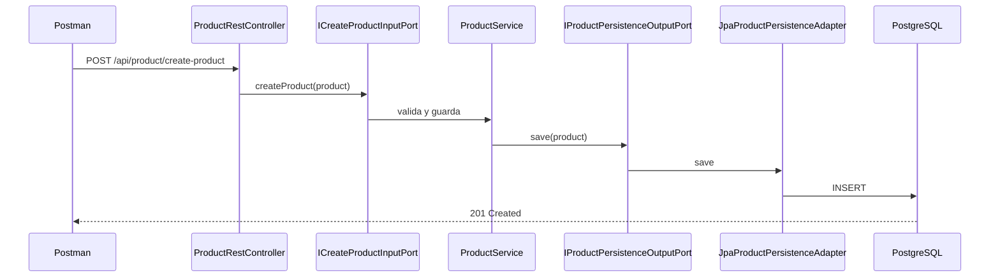
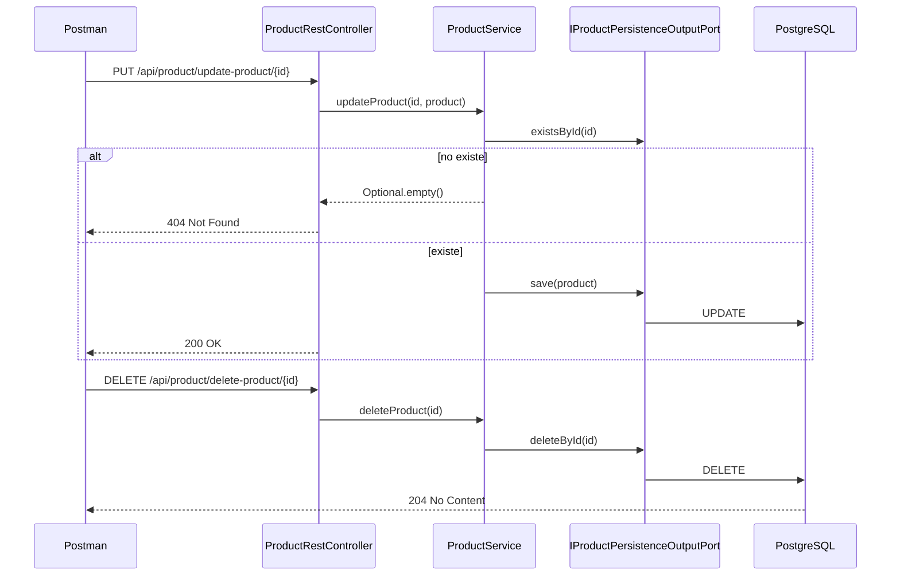

# ms-common-product

Microservicio de productos con **CRUD completo** y **Arquitectura Hexagonal** (Puertos y Adaptadores).

La lógica de negocio vive en el centro (`domain` + `application`). Los detalles técnicos (REST, JPA, PostgreSQL) viven en los bordes (`infrastructure`), conectados mediante **puertos** e **adaptadores**.

### Prefijos de tipos

| Prefijo | Tipo | Ejemplo |
|---------|------|---------|
| `I` | Interfaz (puerto) | `ICreateProductInputPort` |
| `D` | DTO (contrato HTTP / JSON) | `DCreateProductRequest` |
| *(sin prefijo)* | Clase de dominio, servicio, adaptador, entidad | `Product`, `ProductService`, `ProductEntity` |

---

## Tabla de contenido

1. [Idea central](#idea-central)
2. [Estructura del proyecto](#estructura-del-proyecto)
3. [Esquema visual del flujo](#esquema-visual-del-flujo)
4. [Interfaces (puertos)](#interfaces-puertos)
5. [Responsabilidad de cada pieza](#responsabilidad-de-cada-pieza)
6. [Mappers: conversión entre capas](#mappers-conversión-entre-capas)
7. [Reglas de dependencia](#reglas-de-dependencia)
8. [Endpoints CRUD](#endpoints-crud)
9. [Cómo ejecutar](#cómo-ejecutar)
10. [Síntesis teórica](#síntesis-teórica)

---

## Idea central

```
   HTTP / Postman
         │
         ▼
   ProductRestController          ← adaptador de ENTRADA (REST)
         │
         ▼
   Puertos de entrada             ← ICreateProductInputPort, IFindProductByIdInputPort, ...
         │
         ▼
   ProductService                 ← casos de uso + validaciones
         │
         ▼
   IProductPersistenceOutputPort  ← puerto de SALIDA
         │
         ▼
   JpaProductPersistenceAdapter   ← adaptador de SALIDA (JPA)
         │
         ▼
   PostgreSQL (tabla products)
```

El centro **no conoce** REST ni JPA. Solo conoce interfaces (puertos) y el modelo `Product`.

---

## Estructura del proyecto

```
src/main/java/com/practice
│
├── domain
│   └── model
│       └── Product.java
│
├── application
│   ├── port
│   │   ├── in
│   │   │   ├── ICreateProductInputPort.java
│   │   │   ├── IFindProductByIdInputPort.java
│   │   │   ├── IFindAllProductsInputPort.java
│   │   │   ├── IUpdateProductInputPort.java
│   │   │   └── IDeleteProductInputPort.java
│   │   └── out
│   │       └── IProductPersistenceOutputPort.java
│   └── service
│       └── ProductService.java
│
└── infrastructure
    ├── controller
    │   ├── dto
    │   │   ├── DCreateProductRequest.java
    │   │   ├── DUpdateProductRequest.java
    │   │   └── DProductResponse.java
    │   ├── mapper
    │   │   └── ProductRestMapper.java
    │   └── ProductRestController.java
    └── persistence
        ├── ProductEntity.java
        ├── ProductJpaRepository.java
        ├── mapper
        │   └── ProductPersistenceMapper.java
        └── JpaProductPersistenceAdapter.java
```

### Convención de nombres

| Prefijo / sufijo | Significado |
|------------------|-------------|
| `I` + `*InputPort` | Interfaz de entrada (driving port). |
| `I` + `*OutputPort` | Interfaz de salida (driven port). |
| `D` + `*Request` / `*Response` | DTO de la API REST (JSON). |
| `*Adapter` | Implementación concreta de un puerto. |
| `*Mapper` | Traduce entre representaciones. |
| `*Entity` | Entidad JPA (tabla en base de datos). |
| `Product` | Modelo de dominio (sin prefijo). |

---

## Esquema visual del flujo

### Crear producto



### Actualizar / eliminar



---

## Interfaces (puertos)

En Java, una **interfaz** define un contrato: qué métodos existen, sin decir cómo se implementan. En arquitectura hexagonal, esas interfaces se llaman **puertos**: son la frontera entre el centro de la aplicación y el mundo exterior.

El prefijo **`I`** indica que el tipo es una interfaz (puerto), por ejemplo `ICreateProductInputPort` en lugar de `CreateProductInputPort`.

### Dos familias de puertos

```
                    ENTRADA (driving)                    SALIDA (driven)
              "qué puede pedirle alguien                  "qué necesita la app
               a la aplicación"                            para funcionar"

   Postman ──►  ICreateProductInputPort          ProductService ──►  IProductPersistenceOutputPort
                IFindProductByIdInputPort                              │
                IFindAllProductsInputPort                              ▼
                IUpdateProductInputPort                    JpaProductPersistenceAdapter
                IDeleteProductInputPort                              │
                                                                     ▼
                                                            ProductJpaRepository
                                                            (Spring Data, no es puerto de negocio)
```

| Familia | Prefijo en el nombre | Dirección | Quién la define | Quién la usa |
|---------|----------------------|-----------|-----------------|--------------|
| **Puerto de entrada** | `I` + `*InputPort` | Hacia dentro | Capa `application` | Adaptadores de entrada (`ProductRestController`) |
| **Puerto de salida** | `I` + `*OutputPort` | Hacia fuera | Capa `application` | Adaptadores de salida (`JpaProductPersistenceAdapter`) |

- **Entrada:** el cliente (HTTP) invoca la aplicación. El controller conoce `ICreateProductInputPort`, no los detalles de JPA.
- **Salida:** la aplicación necesita persistir datos. `ProductService` conoce `IProductPersistenceOutputPort`, no `ProductJpaRepository`.

### Catálogo de interfaces del proyecto

| Interfaz | Tipo | Operación que declara | Implementada por | Inyectada en |
|----------|------|------------------------|------------------|--------------|
| `ICreateProductInputPort` | Entrada | `createProduct(Product)` | `ProductService` | `ProductRestController` |
| `IFindProductByIdInputPort` | Entrada | `findProductById(Long)` | `ProductService` | `ProductRestController` |
| `IFindAllProductsInputPort` | Entrada | `findAllProducts()` | `ProductService` | `ProductRestController` |
| `IUpdateProductInputPort` | Entrada | `updateProduct(Long, Product)` | `ProductService` | `ProductRestController` |
| `IDeleteProductInputPort` | Entrada | `deleteProduct(Long)` | `ProductService` | `ProductRestController` |
| `IProductPersistenceOutputPort` | Salida | `save`, `findById`, `findAll`, `deleteById`, `existsById` | `JpaProductPersistenceAdapter` | `ProductService` |

`ProductService` **implementa** las cinco interfaces de entrada: es la clase concreta que ejecuta casos de uso y validaciones. El controller **no** llama a `ProductService` por tipo concreto; inyecta cada `I*InputPort` (en la práctica Spring resuelve la misma instancia de `ProductService` para todas).

### Qué problema resuelven

Sin interfaces, el controller podría depender directamente de JPA o el servicio de persistencia:

```
ProductRestController  ──►  ProductJpaRepository   ❌ HTTP acoplado a base de datos
ProductService         ──►  ProductEntity          ❌ negocio acoplado a JPA
```

Con puertos:

```
ProductRestController  ──►  ICreateProductInputPort  ──►  ProductService
ProductService         ──►  IProductPersistenceOutputPort  ──►  JpaProductPersistenceAdapter
```

Cada capa solo ve el contrato que le corresponde. Cambiar PostgreSQL por otro mecanismo implica otro adaptador que implemente `IProductPersistenceOutputPort`, sin reescribir `ProductService` ni el controller.

### Una interfaz por operación de negocio

El CRUD expone cinco operaciones distintas; cada una tiene su puerto de entrada. Eso mantiene contratos pequeños y legibles: quien solo necesita crear productos depende de `ICreateProductInputPort`, no del CRUD completo.

La persistencia se agrupa en un solo puerto de salida (`IProductPersistenceOutputPort`) porque guardar, buscar, listar y eliminar son facetas de la misma necesidad: *almacenar productos*.

### Interfaces que no son puertos de negocio

`ProductJpaRepository` también es una interfaz de Java, pero cumple otro rol: es la API técnica de **Spring Data JPA** sobre `ProductEntity`. Solo la usa `JpaProductPersistenceAdapter`; no forma parte del contrato de la aplicación.

| Interfaz | ¿Puerto hexagonal? | Motivo |
|----------|-------------------|--------|
| `ICreateProductInputPort` | Sí | Contrato de negocio hacia dentro |
| `IProductPersistenceOutputPort` | Sí | Contrato de negocio hacia fuera |
| `ProductJpaRepository` | No | Detalle de infraestructura (JPA) |

### Resumen

> Una interfaz con prefijo **`I`** en este proyecto es un **puerto**: un contrato. La clase que **implementa** el puerto es un **caso de uso** o un **adaptador**. El código que **inyecta** el puerto solo conoce la operación, no la tecnología concreta detrás.

---

## Responsabilidad de cada pieza

### Dominio

**`Product`** — Concepto de negocio. Sin anotaciones de Spring ni JPA.

### Aplicación

**Puertos de entrada** — Contratos de lo que la app ofrece (CRUD).

**`IProductPersistenceOutputPort`** — Contrato de persistencia: guardar, buscar, listar, eliminar, comprobar existencia.

**`ProductService`** — Implementa todos los puertos de entrada. Validaciones de negocio:
- Nombre obligatorio
- Precio mayor que cero
- Stock no negativo
- Producto debe existir para actualizar o eliminar (si no existe, el controller responde `404`)

### Infraestructura — REST

**`ProductRestController`** — Adaptador HTTP. Solo traduce peticiones y respuestas. Usa `Optional` y `boolean` para devolver `404` cuando el producto no existe.

**`ProductRestMapper`** — DTO ↔ dominio.

### Infraestructura — JPA

**`ProductEntity`** — Única entidad JPA (`products`).

**`JpaProductPersistenceAdapter`** — Implementa `IProductPersistenceOutputPort`.

**`ProductPersistenceMapper`** — Traduce `Product` ↔ `ProductEntity`. Solo lo usa el adaptador JPA.

---

## Mappers: conversión entre capas

Un producto se representa de formas distintas según la capa. Cada representación cumple un rol; no deben mezclarse en una sola clase.

| Clase | Capa | Rol |
|-------|------|-----|
| `DCreateProductRequest` / `DProductResponse` | Infraestructura (REST) | Contrato JSON de la API |
| `Product` | Dominio | Modelo de negocio |
| `ProductEntity` | Infraestructura (JPA) | Registro en la tabla `products` |

`Product` no lleva anotaciones de JPA ni de Spring Web. `ProductEntity` no se expone en los endpoints. Los **mappers** traducen de una representación a otra en los límites del sistema.

### Flujo al crear un producto

```
Cliente HTTP (JSON)
    │
    ▼
DCreateProductRequest
    │
    │  ProductRestMapper
    ▼
Product
    │
    │  ProductService → IProductPersistenceOutputPort
    ▼
ProductEntity
    │
    │  ProductPersistenceMapper
    ▼
PostgreSQL
```

### Mappers del proyecto

| Clase | Ubicación | Función |
|-------|-----------|---------|
| `ProductRestMapper` | `infrastructure/controller/mapper` | Convierte entre DTOs HTTP y `Product` |
| `ProductPersistenceMapper` | `infrastructure/persistence/mapper` | Convierte entre `Product` y `ProductEntity` |

Cada mapper opera en una frontera: entrada HTTP o salida a base de datos. No hay un mapper único para todo el flujo; REST y persistencia son responsabilidades separadas.

### Implementación

Las conversiones están escritas de forma explícita (asignación de campos o `builder`). Cuando dos clases comparten los mismos atributos, el código puede parecer repetitivo; esa repetición refleja la copia controlada de datos entre capas, no una duplicación de lógica de negocio.

La lógica de negocio permanece en `ProductService`. Los mappers solo mueven datos entre formatos compatibles con cada capa.

---

## Reglas de dependencia

```
infrastructure  ──►  application  ──►  domain
```

| Desde | Puede depender de | NO debe depender de |
|-------|-------------------|---------------------|
| `domain` | nada externo | application, infrastructure |
| `application` | domain | ProductEntity, controllers, JPA |
| `infrastructure` | application, domain | — |

---

## Endpoints CRUD

Base: `http://localhost:8081`

| Método | Ruta | Descripción | Respuesta |
|--------|------|-------------|-----------|
| `POST` | `/api/product/create-product` | Crear producto | `201` + JSON |
| `GET` | `/api/product/find-product-by-id/{id}` | Consultar por id | `200` o `404` |
| `GET` | `/api/product/find-all-products` | Listar todos | `200` + array JSON |
| `PUT` | `/api/product/update-product/{id}` | Actualizar | `200` o `404` |
| `DELETE` | `/api/product/delete-product/{id}` | Eliminar | `204` o `404` |

### Crear (POST `/api/product/create-product`)

```json
{
  "name": "Teclado mecánico",
  "description": "Teclado RGB",
  "price": 250000,
  "stock": 8
}
```

### Actualizar (PUT `/api/product/update-product/{id}`)

Mismo cuerpo que crear (sin `id` en el JSON; el id va en la URL).

### Respuesta (crear, consultar, actualizar)

```json
{
  "id": 1,
  "name": "Teclado mecánico",
  "description": "Teclado RGB",
  "price": 250000,
  "stock": 8
}
```

---

## Cómo ejecutar

1. Crear la base de datos:
   ```sql
   CREATE DATABASE ms_common_product;
   ```

2. Ajustar credenciales en `src/main/resources/application.yaml` si hace falta.

3. Ejecutar:
   ```bash
   cd microservices-builder
   mvn spring-boot:run -pl ms-common-product
   ```

4. Probar en Postman con las rutas de la tabla anterior, o importar la colección:

   `postman/ms-common-product.postman_collection.json`

   Variables de la colección: `baseUrl` (por defecto `http://localhost:8081`) y `productId` (para consultar, actualizar o eliminar).

### Swagger UI

Con la app en marcha: http://localhost:8081/swagger-ui.html

Muestra solo los endpoints bajo `/api/product/**`, detectados desde `ProductRestController`. Configuración mínima en `application.yaml` (`springdoc`). No hace falta clase de configuración Java ni anotaciones en DTOs o controllers.

---

## Síntesis teórica

Referencia rápida entre conceptos de arquitectura hexagonal y su ubicación en este repositorio. El detalle de cada pieza está en las secciones anteriores.

### Capas y piezas

| Concepto | Rol | Ubicación en el proyecto |
|----------|-----|-------------------------|
| **Dominio** | Modelo de negocio | `domain/model/Product.java` |
| **Caso de uso** | Orquesta una operación y sus reglas | `application/service/ProductService.java` |
| **Puerto de entrada** | Contrato de lo que la app expone | `application/port/in/I*.java` |
| **Puerto de salida** | Contrato de lo que la app necesita | `application/port/out/IProductPersistenceOutputPort.java` |
| **Adaptador de entrada** | Traduce HTTP → aplicación | `infrastructure/controller/ProductRestController.java` |
| **Adaptador de salida** | Traduce aplicación → JPA/BD | `infrastructure/persistence/JpaProductPersistenceAdapter.java` |

### Casos de uso (CRUD)

Cada caso de uso es un método de `ProductService`, declarado en su puerto de entrada:

| Caso de uso | Puerto | Método en `ProductService` |
|-------------|--------|----------------------------|
| Crear producto | `ICreateProductInputPort` | `createProduct` |
| Consultar por id | `IFindProductByIdInputPort` | `findProductById` |
| Listar todos | `IFindAllProductsInputPort` | `findAllProducts` |
| Actualizar | `IUpdateProductInputPort` | `updateProduct` |
| Eliminar | `IDeleteProductInputPort` | `deleteProduct` |

La persistencia no es un caso de uso expuesto al cliente: es una dependencia interna vía `IProductPersistenceOutputPort`, implementada por `JpaProductPersistenceAdapter`.

### Regla en una frase

> **Puertos en `application`, adaptadores en `infrastructure`, dominio en el centro sin frameworks.**
